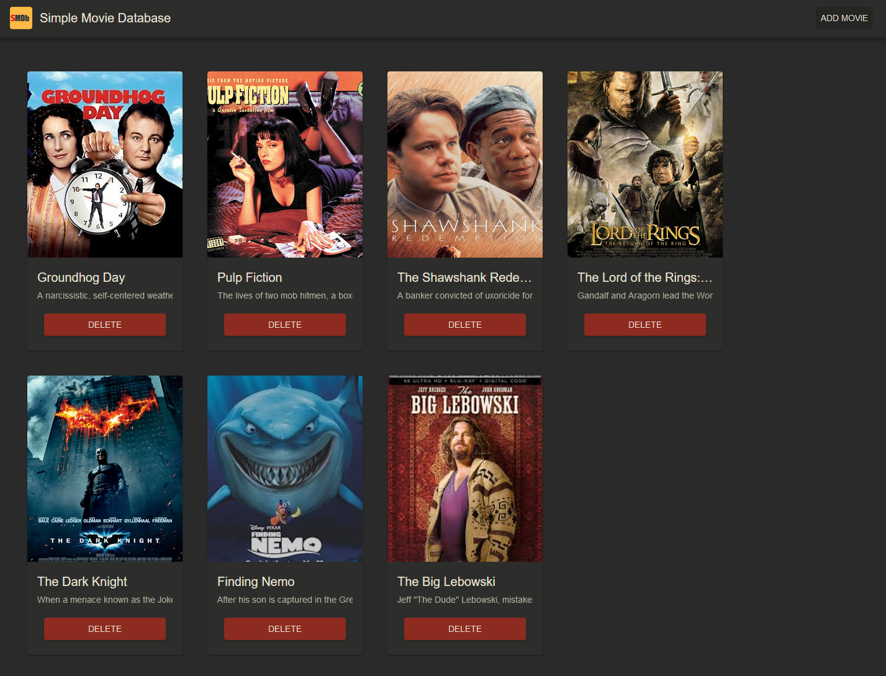
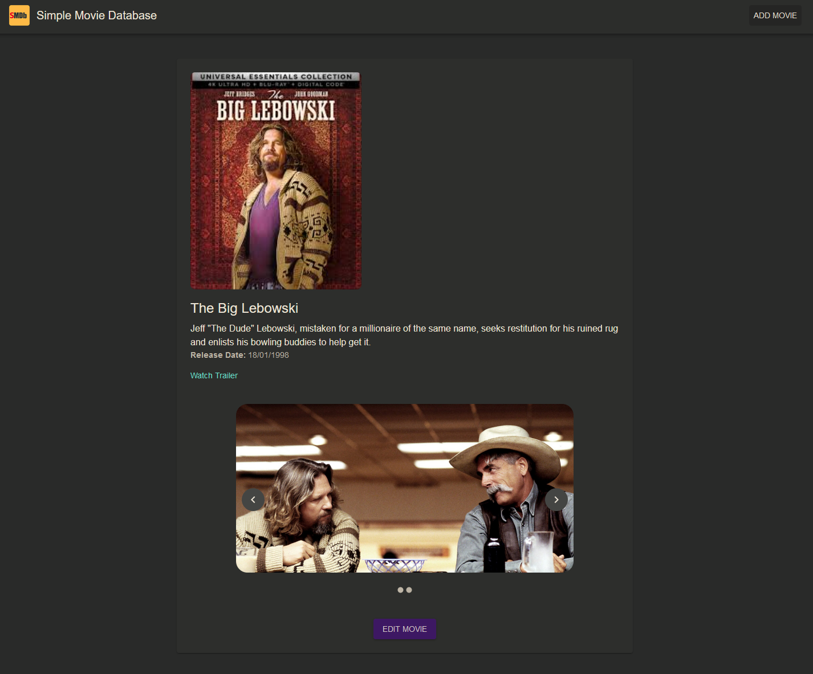

# SMDb - Simple Movie Database

SMDb is a web application for managing a movie database. Users can add, update, view, and delete movies with details such as descriptions, release dates, cover images, trailers, and additional images. This project uses a React frontend and an ASP.NET Core backend with a PostgreSQL database.

The React project that holds the UI can be found at [SMDb-UI](https://github.com/asaivanidis/smdb-ui)

A demo setup is currently hosted at [SMDb-API](https://smdb.saiva.space/)

## Features

- Add new movies with:
  - Title
  - Description
  - Release date
  - Cover image (uploaded to Cloudinary)
  - Additional images
  - Trailer URL
- View a detailed movie page with:
  - Images carousel
  - Movie details
- Edit existing movie details.
- Delete movies.
- Responsive UI built with Material-UI.
- API endpoints for all CRUD operations.
- Integration with Cloudinary for image uploads.

## Tech Stack

- **Frontend**: React (with Material-UI for styling)
- **Backend**: ASP.NET Core (C#)
- **Database**: PostgreSQL
- **Image Storage**: Cloudinary
- **Proxy & Deployment**: Docker, Nginx Proxy Manager

---

## Setup and Installation

### Prerequisites

1. [Node.js](https://nodejs.org/) (for the React frontend)
2. [.NET 6 SDK](https://dotnet.microsoft.com/) or later (for the ASP.NET backend)
3. [Docker](https://www.docker.com/) (for containerized deployment)
4. A Cloudinary account for image hosting.
5. PostgreSQL database.

---

### Local Development

#### 1. Clone the Repository

```
git clone https://github.com/asaivanidis/smdb.git
```

#### 2. Backend Setup

Navigate to the backend directory:

```
cd smdb
```

Set up a PostgreSQL database:
- Create a database named smdb.

Update the connection string in appsettings.json:
```
"ConnectionStrings": {
  "DefaultConnection": "Host=localhost;Database=smdb;Username=your_db_user;Password=your_db_password;"
}
```

Configure Cloudinary settings in appsettings.json:
```
"Cloudinary": {
  "CloudName": "your_cloudinary_cloud_name",
  "ApiKey": "your_cloudinary_api_key",
  "ApiSecret": "your_cloudinary_api_secret"
}
```

Run database migrations:
```
dotnet ef database update
```

Start the backend:
```
dotnet run
```

#### 3. Frontend Setup
Navigate to the frontend directory:
```
cd smdb-ui
```

Install dependencies:
```
npm install
```

Set up the API base URL in the .env file:
```
REACT_APP_API_BASE_URL=http://localhost:5000
```

Start the frontend:
```
npm start
```

#### 4. Access the Application

Frontend: http://localhost:3000
Backend API: http://localhost:5000


### Deployment with Docker
#### 1. Update Environment Variables
Update the following environment variables in docker-compose.yml:
- POSTGRES_USER
- POSTGRES_PASSWORD
- POSTGRES_DB
- Cloudinary credentials in the backend configuration.

#### 2. Build and Start Services
```
docker-compose up --build
```

#### 3. Access the Deployed App
Frontend: http://<your-server-ip>
Backend API: http://<your-server-ip>:5000

### API Endpoints
#### Movies API

GET	/api/movies	- Get all movies
GET	/api/movies/{id} - Get a specific movie by ID
POST	/api/movies	- Add a new movie
PUT	/api/movies/{id} - Update a movie
DELETE	/api/movies/{id} - Delete a movie
POST	/api/movies/upload - Upload an image to Cloudinary

#### Request/Response Formats
##### Add Movie (POST /api/movies):
Request Body:
```json
{
  "title": "Movie Title",
  "description": "Movie Description",
  "releaseDate": "YYYY-MM-DD",
  "coverImageUrl": "https://cloudinary.com/image.jpg",
  "imageUrls": [
    "https://cloudinary.com/image1.jpg",
    "https://cloudinary.com/image2.jpg"
  ],
  "trailerUrl": "https://youtube.com/trailer"
}
```
Response:
```json
    {
      "movieId": 1,
      "title": "Movie Title",
      "description": "Movie Description",
      "releaseDate": "YYYY-MM-DD",
      "coverImageUrl": "https://cloudinary.com/image.jpg",
      "imageUrls": [
        "https://cloudinary.com/image1.jpg",
        "https://cloudinary.com/image2.jpg"
      ],
      "trailerUrl": "https://youtube.com/trailer"
    }
```

### Screenshots
Home Page - Display of movies with cover images and titles.



Movie Details Page - A carousel of images with details and an edit button.


